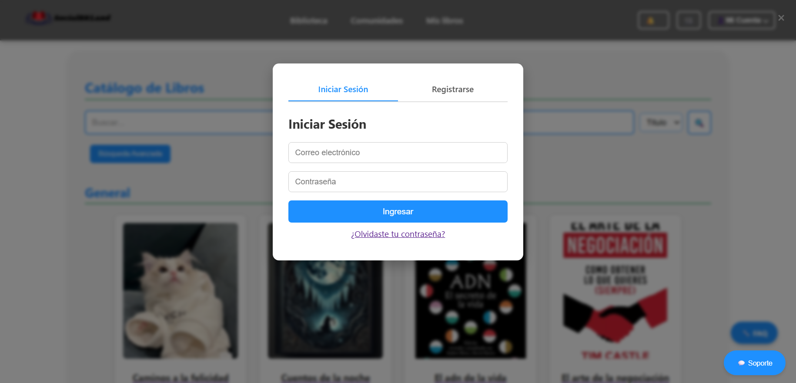

# SocialBKLand
SocialBKLand is a platform that combines e-commerce and social networking for book management and purchasing. It allows users to explore a catalog of digital and physical books, interact in reader communities, and make purchases through a simulated payment gateway.

## Content Table
  - [Demo](#demo)
  - [Features](#features)
  - [Installation steps](#installation-steps)
  - [The process](#the-process)
    - [Build with](#build-with)
    - [Structure](#structure)
  - [Useful resources](#useful-resources)
  - [License](#license)
  - [Authors](#authors)

## Demo
You can explore a preview of the system using the following demo user:

**Demo user:** `admin@example.com`  
**Password:** `admin123`

### Screenshots

#### Login Screen


#### Library Module


#### Communities View


### Admin View


## Features

###  User Features
- User registration and login with secure credentials
- Password recovery system
- User profile update functionality
- Role-based access control (Admin, Moderator, User)

### Book Catalog and Shopping
- View organized catalog of books by categories
- Search books by title, author, and genre
- Filter books by price or format
- Add and remove books from cart
- Simulated payment gateway to complete purchases

### Reviews and Interaction
- Post and read reviews about purchased books
- Comment on others' reviews
- Moderators can approve or remove inappropriate reviews

### Communities
- Users can create reading communities
- Join existing communities based on interests
- Publish posts and interact with community members
- Moderators manage content and users
- Admins can remove non-compliant communities

### Order Tracking and Help
- Simulated order tracking with predefined statuses
- Access to a help center and FAQ section
- Simulated support chat for quick assistance

##  Installation steps

Follow these steps to get SocialBKLand running on your machine:

### 1. Prerequisites

Make sure you have the following installed:

- [Node.js](https://nodejs.org/en/download/)  
- [MongoDB Community Edition](https://www.mongodb.com/try/download/community)  

If you don’t have them yet, download and install them from the official links above.


### 2. Clone the project

Open your terminal and run:

```
git clone https://github.com/your-username/socialbkland.git  
```
Then go to the project folder:
```
cd socialbkland/backend
```


### 3. Install dependencies

Inside the `backend` folder, run:
```
npm install
```


### 4. Start MongoDB

In case MongoDB is not already running:

- Open one terminal and run:
```
mongod
```
- Open another terminal and run:

```
mongosh
```
Keep both terminals open while using the app.


### 5. Run the server

Start the backend server by running:

node server.js

You should see a message confirming the server is running on port 5000.


### 6. Open the app

In your browser, go to:

http://SocialBKLand.com

You’re now ready to explore **SocialBKLand**


## The process
### Build with
### Front-end  
- JavaScript  
- CSS  
- HTML  

### Back-end  
- Node.js  
- JSON  

###  IDE  
- Visual Studio Code  

### Base de datos  
- MongoDB  

### Structure

- The project follows a modular structure separating concerns between backend logic, static assets, and user interface modules.
It includes organized folders for configuration, routes, models, utilities, and front-end resources like styles, images, and JavaScript components.
This structure improves maintainability, scalability, and clarity during development.


## Useful resources
- [Figma](https://www.figma.com/design/0qSXFXaCtRPFy4QjuW9rHo/SocialBKLand?node-id=0-1&p=f&t=EISqFc4MZA3paGy2-0) - Used to create graphics
- [TM Notion](https://www.notion.so/) - Used to organize tasks, notes, and project documentation
- [JIRA Board (Sprint Tasks)](https://elpoli-team-socialbkland.atlassian.net/jira/software/projects/SOC/list?filter=assignee%20IN%20(%2262cf3af6afe495359d9deb61%22%2C%20%22712020%3A54668b4b-eec5-4eb9-a55e-ea77e80cf75a%22%2C%20%22712020%3A170c6686-8c09-4294-8efa-caa218f06ad3%22%2C%20%22712020%3Aec695860-391a-48cc-a4a2-fa4012be8b2f%22)&groupBy=assignee) – Agile task tracking and sprint management.
## License
Without license

## Authors

- Mateo Berrío Cardona
- Esteban Cano Ramírez
- Camilo Enoc Martínez Duque
- Mariana Montoya Sepúlveda

